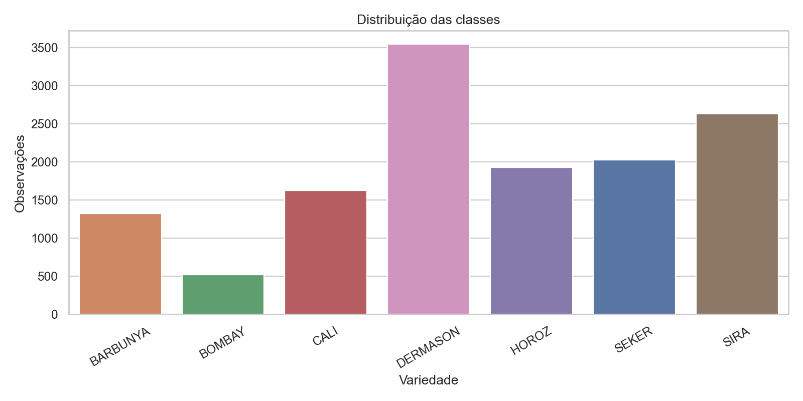
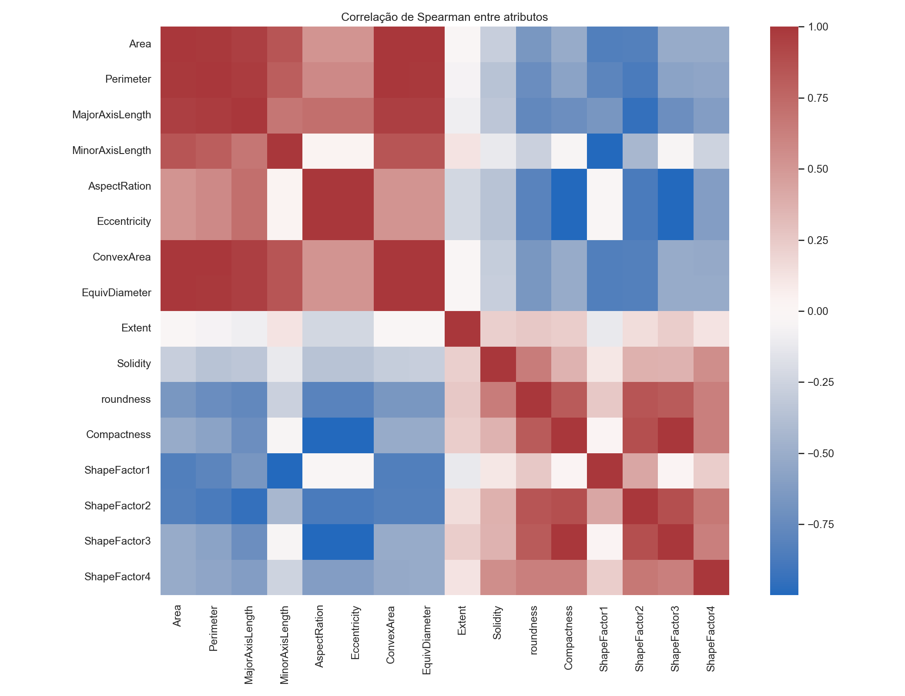
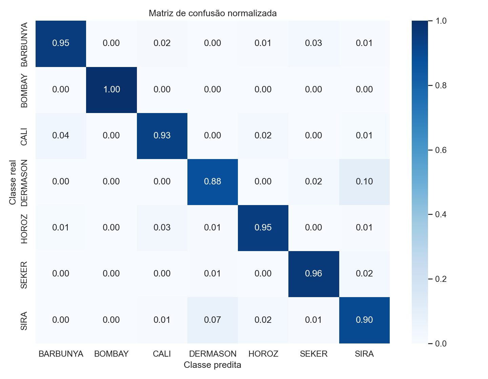
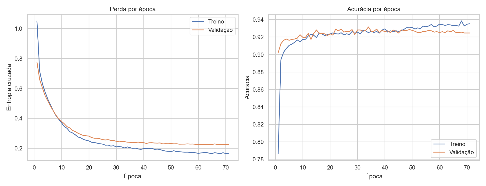
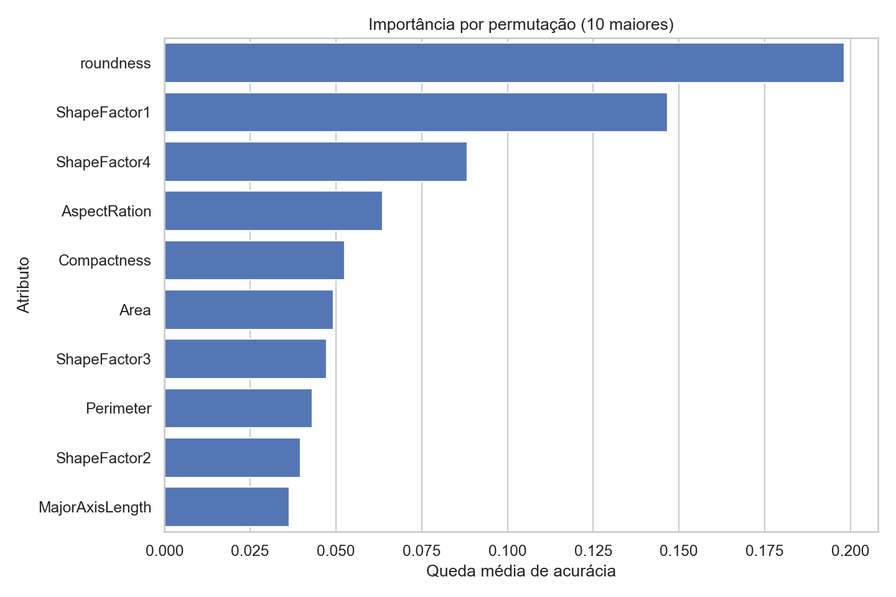

# Classificação de variedades de feijão seco com redes neurais profundas

**Disciplina:** Inteligência Artificial II  
**Atividade:** Parada Obrigatória 1  
**Autores e matrículas:** *preencher antes da submissão*  
**Data:** 27 de setembro de 2026

## Sumário

1. [Introdução](#1-introdução)
2. [Problema, domínio e objetivos](#2-problema-domínio-e-objetivos)
3. [Base de dados](#3-base-de-dados)
4. [Metodologia](#4-metodologia)
5. [Resultados](#5-resultados)
6. [Discussão crítica](#6-discussão-crítica)
7. [Conclusões e recomendações](#7-conclusões-e-recomendações)
8. [Reprodutibilidade](#8-reprodutibilidade)
9. [Referências](#9-referências)

## Resumo

Este trabalho investiga a classificação automática de sete variedades de
feijão seco a partir de 16 atributos geométricos extraídos por um sistema de
visão computacional. Foram analisadas 13.611 observações da base *Dry Bean* do
UCI Machine Learning Repository. Apó a remoção de 68 duplicatas exatas, os dados
foram separados de forma estratificada em treino (70%), validação (15%) e teste
(15%). Uma rede neural densa foi otimizada por busca aleatória em 12
configurações, com pesos de classe, regularização L2, *dropout*, normalização em
lote, redução da taxa de aprendizagem e parada antecipada. No conjunto de teste
isolado, o modelo alcançou acurácia de **92,22%**, acurácia balanceada de
**93,85%** e F1 macro de **93,66%**. A melhora de 0,49 ponto percentual sobre a
regressão logística não foi estatisticamente conclusiva no teste pareado de
McNemar ($p=0,237$). Portanto, a rede é funcional e competitiva, mas o resultado
também evidencia que a estrutura do problema permite excelente desempenho com
um modelo linear mais simples.

**Palavras-chave:** classificação multiclasse; TensorFlow; rede neural; busca de
hiperparâmetros; visão computacional; feijão seco.

## 1. Introdução

A separação correta de cultivares é relevante para controle de qualidade,
padronização de lotes e comercialização de sementes. A inspeção manual pode ser
demorada e sujeita à variabilidade entre avaliadores. Medidas extraídas de
imagens oferecem uma alternativa objetiva e passível de automação.

Köklü e Özkan (2020) construíram um sistema de visão computacional para
segmentar grãos e obter medidas de tamanho e forma. A base resultante é adequada
a este estudo porque possui fonte acadêmica identificável, licença aberta,
número suficiente de exemplos, classes semelhantes e desbalanceadas e uma
tarefa multiclasse com aplicação concreta. Diferentemente de bases introdutórias
de imagens frequentemente utilizadas em aula, ela exige discutir redundância
entre medidas, desequilíbrio e generalização.

## 2. Problema, domínio e objetivos

O domínio é a inspeção agrícola auxiliada por visão computacional. A entrada do
protótipo é um vetor com 16 medidas de um grão previamente segmentado; a saída é
uma distribuição de probabilidade sobre sete variedades: BARBUNYA, BOMBAY, CALI,
DERMASON, HOROZ, SEKER e SIRA.

O objetivo geral é desenvolver, ajustar e avaliar um classificador de *deep
learning* reproduzível. Os objetivos específicos são:

1. verificar integridade, distribuições, desbalanceamento, atípicos e relações
   entre atributos;
2. impedir vazamento de dados por meio de partições isoladas e transformações
   ajustadas apenas no treino;
3. comparar a rede a referências simples;
4. buscar automaticamente hiperparâmetros e controlar *overfitting*;
5. avaliar desempenho global, por classe e com estimativa de incerteza;
6. registrar código, dependências, semente, dados e artefatos necessários à
   reprodução.

## 3. Base de dados

### 3.1 Origem e contexto

A base *Dry Bean* foi publicada no UCI Machine Learning Repository sob licença
CC BY 4.0 e DOI [10.24432/C50S4B](https://doi.org/10.24432/C50S4B). Câmeras de
alta resolução registraram 13.611 grãos. Apó segmentação, foram calculadas 12
dimensões e quatro fatores de forma. O artigo que introduz a base descreve os
procedimentos de aquisição e compara classificadores clássicos.

O arquivo original em XLSX foi mantido sem alterações. O ZIP possui SHA-256
`0a64eff5be87f48c3dbbfc0a12a56c5d5b5167ef8e61cd45d69b3e7c7130c06f`, o que
permite detectar troca ou corrupção do dado.

### 3.2 Variáveis

| Grupo | Variáveis | Interpretação |
|---|---|---|
| Tamanho | `Area`, `Perimeter`, `ConvexArea`, `EquivDiameter` | Área, contorno, envoltória convexa e diâmetro equivalente |
| Eixos | `MajorAxisLength`, `MinorAxisLength` | Comprimentos dos eixos principal e perpendicular |
| Proporção | `AspectRation`, `Eccentricity`, `Extent`, `Solidity` | Alongamento, excentricidade, ocupação da caixa e convexidade |
| Forma | `roundness`, `Compactness`, `ShapeFactor1` a `ShapeFactor4` | Circularidade, compacidade e fatores derivados |
| Alvo | `Class` | Uma das sete variedades registradas |

Os nomes `AspectRation` e `roundness` foram preservados exatamente como aparecem
na fonte para garantir rastreabilidade.

### 3.3 Análise descritiva e qualidade

Não foram encontrados valores ausentes, infinitos nem medidas fora dos domínios
geométricos validados. Foram encontradas 68 linhas exatamente duplicadas (0,50%);
elas foram removidas antes da divisão para que cópias idênticas não aparecessem
simultaneamente em treino e teste. Não se removeram atípicos identificados pela
regra do intervalo interquartil: formas extremas podem ser observações legítimas,
e sua eliminação sem conhecimento agronômico introduziria viés.

A classe majoritária é DERMASON (3.546 exemplos) e a minoritária é BOMBAY (522),
razão de 6,79:1. Por isso, além de acurácia, foram adotadas acurácia balanceada
e F1 macro, e o treinamento usou pesos inversamente proporcionais à frequência
das classes.



A ANOVA descritiva indicou forte separação entre classes para `Area`
($\eta^2=0,928$), `ConvexArea` ($\eta^2=0,927$), `EquivDiameter`
($\eta^2=0,918$), `Perimeter` ($\eta^2=0,915$) e `MinorAxisLength`
($\eta^2=0,908$). Esses tamanhos de efeito não implicam causalidade e os valores
de $p$ não foram usados para selecionar atributos.

Há redundância previsível entre grandezas derivadas. Por exemplo, as correlações
de postos entre `Area` e `EquivDiameter`, `AspectRation` e `Eccentricity`, e
`Compactness` e `ShapeFactor3` são 1,000 quando arredondadas. Isso favorece uma
avaliação comparativa com modelo linear e exige cautela na interpretação de
importância individual.



As estatísticas completas, contagens de atípicos e associações estão em
`artifacts/tables/`.

## 4. Metodologia

### 4.1 Delineamento experimental

Depois de remover duplicatas, restaram 13.543 observações. Com semente 42,
foram construídas partições estratificadas e mutuamente exclusivas:

| Partição | Observações | Proporção | Uso |
|---|---:|---:|---|
| Treino | 9.480 | 70,00% | Ajuste de pesos e do pré-processamento |
| Validação | 2.031 | 15,00% | Busca de hiperparâmetros e parada antecipada |
| Teste | 2.032 | 15,00% | Uma avaliação final |

O `StandardScaler` foi ajustado exclusivamente no treino e depois aplicado às
demais partições. As médias e desvios transformados do treino foram validados
numericamente como 0 e 1. Os rótulos foram codificados de 0 a 6 por ordem
alfabética. O manifesto `data_split.csv` preserva a partição de cada linha e
permite verificar que não há interseção.

### 4.2 Referências de desempenho

Foram ajustadas duas referências sobre as mesmas partições: (i) predição
constante pela frequência a priori, que mede o resultado trivial; e (ii) regressão
logística multinomial balanceada, que verifica quanto da separação pode ser
explicado por fronteiras lineares.

### 4.3 Rede neural e treinamento

A arquitetura é um perceptron multicamadas implementado em TensorFlow/Keras. A
entrada tem 16 unidades, as camadas ocultas usam ativação ReLU e inicialização
He, e a saída usa sete unidades *softmax*. A função de custo é entropia cruzada
categórica esparsa, otimizada por Adam em lotes de 64 exemplos.

O espaço de busca foi:

| Hiperparâmetro | Valores candidatos |
|---|---|
| Camadas ocultas | 1, 2 ou 3 |
| Unidades por camada | 32, 64, 128 ou 256 |
| *Dropout* | 0,10; 0,25; 0,40 |
| Regularização L2 | $10^{-5}$; $10^{-4}$; $10^{-3}$ |
| Normalização em lote | sim ou não |
| Taxa de aprendizagem | $10^{-4}$; $3\times10^{-4}$; $10^{-3}$; $3\times10^{-3}$ |

O `RandomSearch` avaliou 12 configurações, maximizando a acurácia de validação
por até 60 épocas. Cada tentativa usou parada antecipada com paciência de dez
épocas. Um modelo novo, construído com os melhores hiperparâmetros, foi treinado
por no máximo 120 épocas, com restauração dos pesos de menor perda de validação
e redução pela metade da taxa de aprendizagem quando a perda estagnou.

A configuração escolhida possui uma camada oculta de 256 unidades,
normalização em lote, *dropout* de 0,40, L2 de $10^{-3}$ e taxa inicial de
$10^{-3}$. O treinamento parou em 71 épocas e restaurou o ponto de menor perda,
na época 61.

### 4.4 Avaliação

Foram calculadas acurácia, acurácia balanceada, F1 macro, F1 ponderado,
*log-loss*, precisão e revocação por classe. Intervalos percentis de 95% foram
estimados por 2.000 reamostragens *bootstrap* do teste. A rede e a regressão
logística foram comparadas pelo teste binomial exato de McNemar sobre seus erros
pareados. Por fim, a importância por permutação foi estimada em dez repetições
por atributo.

## 5. Resultados

### 5.1 Desempenho global

| Modelo | Acurácia | Acurácia balanceada | F1 macro | F1 ponderado | *Log-loss* |
|---|---:|---:|---:|---:|---:|
| Classe majoritária | 26,18% | 14,29% | 5,93% | 10,86% | — |
| Regressão logística | 91,73% | 93,46% | 93,27% | 91,75% | 0,226 |
| **Rede neural ajustada** | **92,22%** | **93,85%** | **93,66%** | **92,24%** | **0,211** |

O intervalo *bootstrap* de 95% foi [90,99%; 93,36%] para acurácia e [92,59%;
94,60%] para F1 macro. A rede acertou sozinha 34 casos nos quais a regressão
logística errou; a regressão acertou sozinha 24. O teste exato de McNemar
resultou em $p=0,237$, insuficiente para rejeitar equivalência dos erros ao nível
de 5%.

### 5.2 Desempenho por classe

| Classe | Precisão | Revocação | F1 | Suporte |
|---|---:|---:|---:|---:|
| BARBUNYA | 93,53% | 94,95% | 94,24% | 198 |
| BOMBAY | 100,00% | 100,00% | 100,00% | 78 |
| CALI | 94,24% | 93,47% | 93,85% | 245 |
| DERMASON | 93,57% | 87,59% | 90,49% | 532 |
| HOROZ | 94,96% | 94,62% | 94,79% | 279 |
| SEKER | 94,21% | 96,38% | 95,28% | 304 |
| SIRA | 84,16% | 89,90% | 86,94% | 396 |

BOMBAY foi perfeitamente separada no teste, apesar de ser a classe minoritária.
SIRA apresentou o menor F1, principalmente devido à precisão de 84,16%.
DERMASON teve a menor revocação (87,59%). Portanto, a frequência de uma classe
não explica sozinha sua dificuldade; a sobreposição geométrica entre variedades
é decisiva.



### 5.3 *Overfitting* e interpretação

A acurácia final registrada foi 93,52% no treino e 92,47% na validação, diferença
de 1,06 ponto percentual. A perda de validação atingiu mínimo de 0,225 e depois
estagnou; a parada antecipada evitou continuar otimizando somente o treino. A
combinação de L2 relativamente forte, *dropout* de 40% e restauração do melhor
ponto foi coerente com esse pequeno hiato de generalização.



Na permutação, `roundness` causou a maior queda de acurácia (19,82 pontos
percentuais), seguida por `ShapeFactor1` (14,67), `ShapeFactor4` (8,82),
`AspectRation` (6,37) e `Compactness` (5,26). Como muitos atributos são quase
deterministicamente correlacionados, esses valores medem dependência preditiva
condicionada ao conjunto atual, e não relevância causal isolada.



## 6. Discussão crítica

O modelo superou com grande margem a estratégia trivial e apresentou desempenho
forte em todas as classes. A acurácia de 92,22% é compatível com a dificuldade
relatada no artigo original, que obteve 91,73% para MLP e 93,13% para SVM sob
validação cruzada. A comparação é apenas contextual: o trabalho original usou
outro protocolo, enquanto aqui há teste isolado, remoção explícita de duplicatas
e uma única semente.

A regressão logística atingiu 91,73% e seu intervalo de desempenho prático está
muito próximo ao da rede. O teste pareado não sustenta afirmar que a rede é
superior na população. Se custo computacional, auditabilidade e facilidade de
implantação forem prioritários, a regressão é uma alternativa razoável. Se o
objetivo for explorar relações não lineares e produzir probabilidades ligeiramente
melhores, a rede é defensável.

As principais limitações são:

- a base contém atributos extraídos, e não as imagens originais; o sistema não
  aprende a segmentação e depende de medições produzidas da mesma forma;
- a amostra parece provir de condições controladas, sem validação externa em
  outros equipamentos, safras, localidades ou iluminações;
- 12 tentativas cobrem apenas uma fração do espaço de hiperparâmetros;
- uma única divisão reduz o custo e preserva um teste limpo, mas não mede a
  variabilidade entre diferentes partições;
- os intervalos *bootstrap* condicionam-se a este conjunto de teste e não
  incorporam a variabilidade de treinamento;
- a importância por permutação é instável diante da alta colinearidade observada.

## 7. Conclusões e recomendações

Foi construído um protótipo completo, testado e reproduzível para classificar
sete variedades de feijão. O tratamento de dados evitou vazamento, a busca de
hiperparâmetros foi documentada e as técnicas de regularização limitaram o
*overfitting*. O resultado de 92,22% de acurácia e 93,66% de F1 macro atende ao
objetivo, mas a análise estatística recomenda não exagerar a vantagem sobre a
regressão logística.

Como continuidade, recomenda-se:

1. realizar validação cruzada aninhada e repetir o treinamento com várias
   sementes;
2. ampliar a busca com otimização Bayesiana ou Hyperband, mantendo orçamento
   comparável;
3. avaliar calibração das probabilidades e definir regra de rejeição para casos
   de baixa confiança;
4. coletar um teste externo de outras safras e dispositivos para detectar mudança
   de domínio;
5. comparar seleção de atributos ou PCA para reduzir redundância;
6. caso as imagens sejam disponibilizadas, comparar o fluxo atual com uma CNN
   treinada diretamente nos pixels;
7. antes do uso real, analisar custos assimétricos de erro e desempenho por lote,
   origem e condição de captura.

## 8. Reprodutibilidade

O experimento final foi executado em Python 3.12.14, TensorFlow 2.20.0,
Keras Tuner 1.4.7, NumPy 2.2.6, pandas 2.3.3 e scikit-learn 1.7.2. As versões
completas estão fixadas em `requirements.txt` e registradas novamente em
`artifacts/reproducibility_manifest.json`.

No PowerShell, a partir da raiz do repositório:

```powershell
python -m venv .venv
.venv\Scripts\python -m pip install -r requirements.txt
.venv\Scripts\python dry_bean_study.py --stage all
.venv\Scripts\python -m pytest -q
```

O programa baixa novamente a base oficial se ela não estiver em `data/`. As
etapas também podem ser verificadas separadamente por `--stage validate` e
`--stage eda`. O modo `--quick` existe somente para teste de integração e não
deve ser usado para reproduzir os números deste relatório. O notebook
`dry_bean_study.ipynb` é uma conversão direta do mesmo código-fonte e foi
executado integralmente.

Os artefatos incluem o modelo `.keras`, codificador de rótulos, padronizador,
predições individuais, todas as tentativas de busca, métricas, tabelas e figuras.

## 9. Referências

1. KÖKLÜ, M.; ÖZKAN, I. A. Multiclass classification of dry beans using
   computer vision and machine learning techniques. *Computers and Electronics
   in Agriculture*, v. 174, 105507, 2020.
   [https://doi.org/10.1016/j.compag.2020.105507](https://doi.org/10.1016/j.compag.2020.105507).
2. UCI MACHINE LEARNING REPOSITORY. *Dry Bean Dataset*. 2020.
   [https://doi.org/10.24432/C50S4B](https://doi.org/10.24432/C50S4B).
3. TENSORFLOW. *Keras: the high-level API for TensorFlow*.
   [https://www.tensorflow.org/guide/keras](https://www.tensorflow.org/guide/keras).
4. TENSORFLOW. *tf.keras.callbacks.EarlyStopping*.
   [https://www.tensorflow.org/api_docs/python/tf/keras/callbacks/EarlyStopping](https://www.tensorflow.org/api_docs/python/tf/keras/callbacks/EarlyStopping).
5. KERAS. *KerasTuner: hyperparameter tuning*.
   [https://keras.io/keras_tuner/](https://keras.io/keras_tuner/).
6. SCIKIT-LEARN. *train_test_split*.
   [https://scikit-learn.org/stable/modules/generated/sklearn.model_selection.train_test_split.html](https://scikit-learn.org/stable/modules/generated/sklearn.model_selection.train_test_split.html).

## Anexo A — Mapa dos principais artefatos

| Artefato | Finalidade |
|---|---|
| `dry_bean_study.py` | Código-fonte canônico e executável |
| `dry_bean_study.ipynb` | Notebook rico derivado sem alterar o código |
| `artifacts/model/dry_bean_classifier.keras` | Rede treinada |
| `artifacts/model/standard_scaler.joblib` | Transformação dos atributos |
| `artifacts/model/label_encoder.joblib` | Mapeamento entre índices e classes |
| `artifacts/final_results.json` | Métricas e diagnósticos finais |
| `artifacts/tables/hyperparameter_trials.csv` | Resultado das 12 tentativas |
| `artifacts/tables/test_predictions.csv` | Predições auditáveis do teste |
| `artifacts/reproducibility_manifest.json` | Ambiente, configuração e hash |
